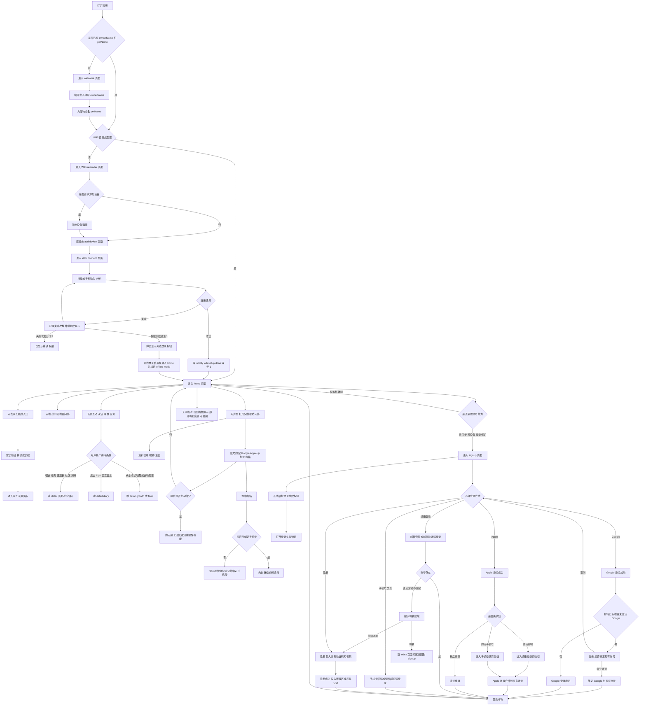

# Noddy 原型全流程图

> 说明：这是 Mermaid 语法流程图。可在支持 Mermaid 的编辑器中直接渲染，再导出 PNG/SVG。

## 导出方法

1. **最快方式（在线）**
   - 打开 [Mermaid Live Editor](https://mermaid.live/)
   - 粘贴上面的 Mermaid 代码
   - 右上角 `Export` 导出 `PNG` 或 `SVG`

2. **放到文档里**
   - 导出 PNG 后直接插入 Word/飞书/Notion
   - 或者在支持 Mermaid 的 Markdown 工具（Typora、Obsidian）中直接渲染截图

3. **如果你要我直接给你图片文件**
   - 我可以再给你生成一份 `流程图.png` 放在同目录
